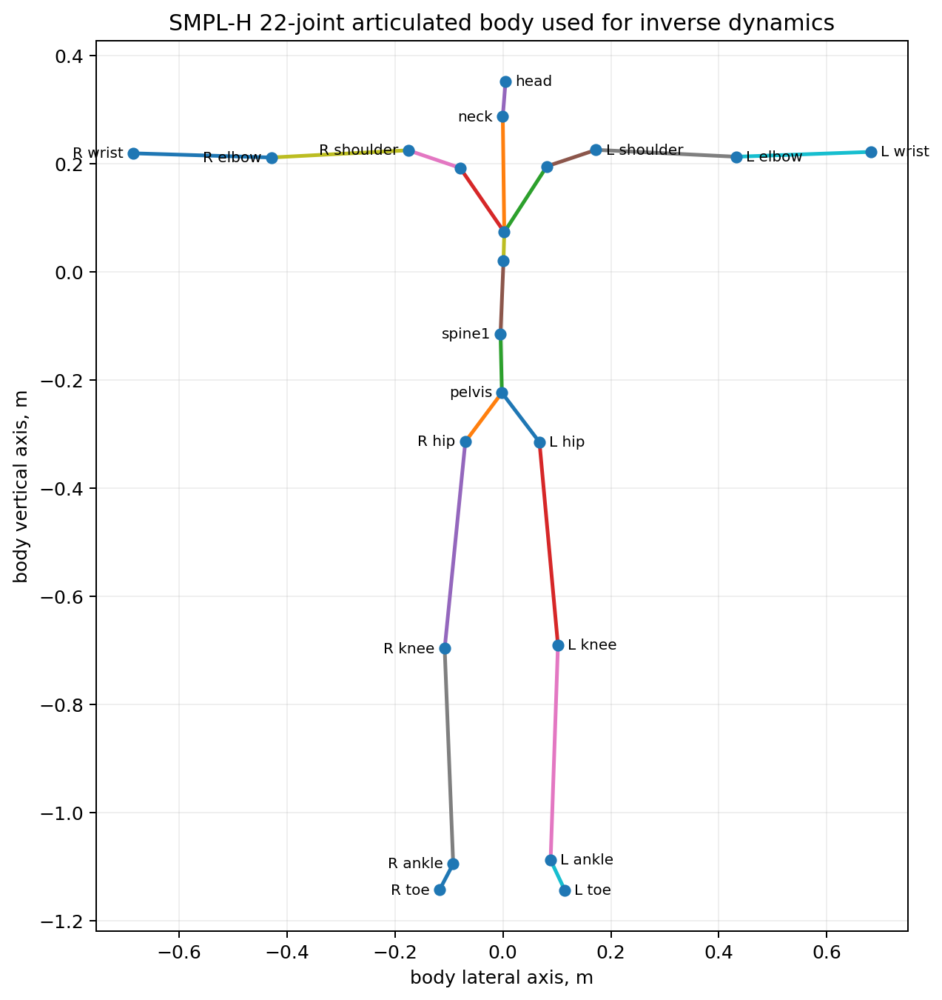
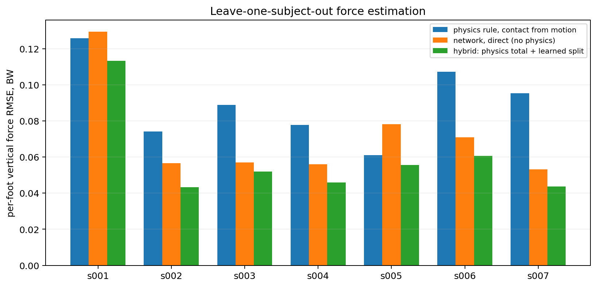
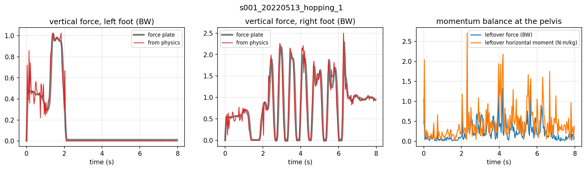
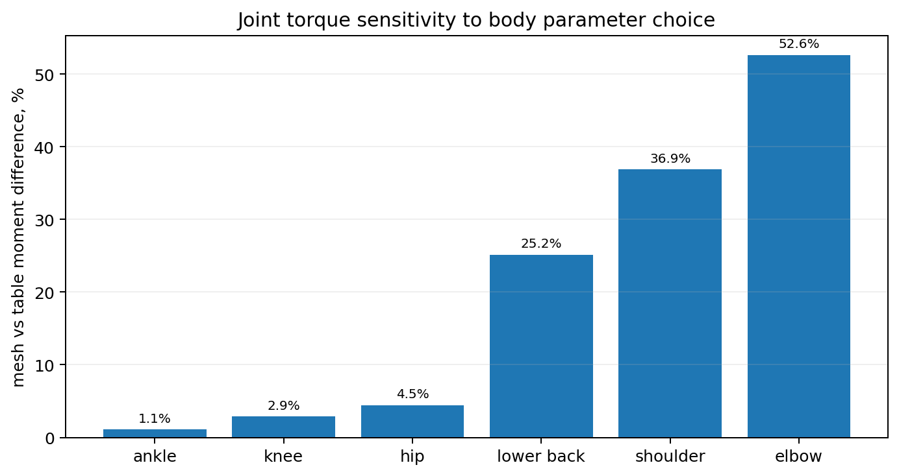
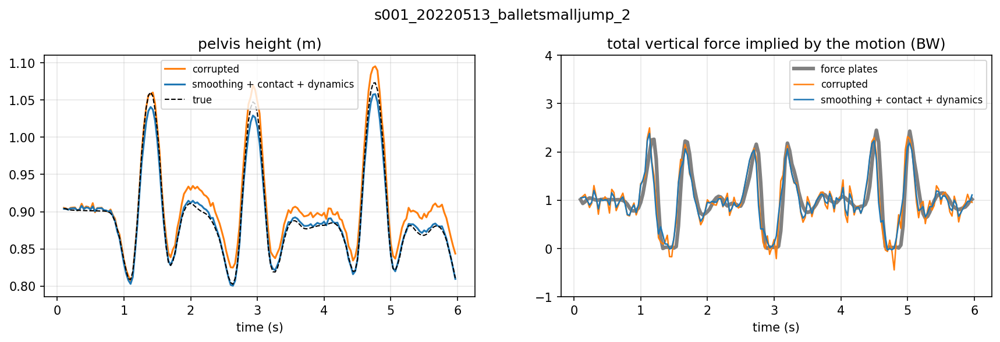

# Physics-Aware Human Dynamics

Ground reaction forces and joint torques from 3D human motion using PyTorch, SMPL-H, GroundLink, whole-body momentum, Newton-Euler inverse dynamics, and temporal learning.

Resrach Question: how much physical information can be recovered from motion alone, and where does a learned temporal model add value?

> The original source code and repository-specific material are proprietary and provided for review only. See `LICENSE`. GroundLink, SMPL-H, and other third-party assets keep their own licenses and are not redistributed here.

## Project summary

The experiments use 336 retained GroundLink force-plate trials from 7 subjects after motion-force synchronization, subject calibration, and dynamics consistency filtering. The pipeline derives segment mass fractions, centers of mass, and inertia tensors from SMPL-H geometry, computes full-body Newton-Euler inverse dynamics, estimates total ground force from whole-body momentum, and learns how to divide that force between the feet.

The central model is a hybrid force estimator. Whole-body dynamics supplies total ground force. A temporal convolutional network learns only the left-right split and a horizontal residual pair. In leave-one-subject-out evaluation over all 7 subjects, the hybrid reaches 0.059 body weights per-foot vertical force RMSE. The direct network reaches 0.072 body weights and the motion-contact physics rule reaches 0.090 body weights. This is an 18 percent reduction relative to the direct network and a 34 percent reduction relative to the physics-only split.

- Recovered ground reaction forces and joint torques from 3D human motion using 336 retained GroundLink force-plate trials from 7 subjects.
- Derived body segment mass fractions, centers of mass, and inertia tensors from the SMPL-H mesh.
- Implemented full-body Newton-Euler inverse dynamics and checked motions against gravity, force balance, linear momentum, and angular momentum consistency.
- Built a hybrid temporal model where whole-body momentum supplies total ground force and the network learns only the left-right force split.
- Connected an articulated pose tracker to the same physics pipeline and measured downstream force degradation from tracked rather than reference motion.
- Evaluated the learned force models with leave-one-subject-out testing across all 7 subjects.

## Articulated body model

The dynamics model uses the first 22 SMPL-H joints as the full-body articulated chain. Segment inertial parameters are derived from vertices assigned by dominant skinning weight. Finger vertices are folded into their parent hand segments for the 22-segment dynamics model.



## Main results

| Experiment | Result |
| --- | ---: |
| Retained GroundLink trials | 336 |
| Subjects | 7 |
| Valid frames after dynamics consistency filter | 83.8% |
| Contact from motion vs measured contact agreement | 96.7% |
| Physics total vertical force RMSE | 0.048 BW |
| Physics ZMP vs measured CoP, median | 3.026 cm |
| Direct network per-foot vertical force RMSE | 0.072 BW |
| Hybrid, physics total + learned split | **0.059 BW** |
| Hybrid + physics quantities as input | **0.056 BW** |
| Physics rule, contact from motion | 0.090 BW |
| Physics rule, measured contact | 0.079 BW |
| True-pose physics chain | 0.052 BW per foot |
| Tracked-pose physics chain | 0.060 BW per foot |
| Tracker joint error in the GroundLink stress test | 36.1 mm |

The 0.059 BW hybrid beats the direct network on all 7 held-out subjects and beats the motion-contact physics rule on all 7 held-out subjects.



## Physics-only force recovery

Whole-body center-of-mass acceleration supplies total ground force:

\[
F_{total} = \frac{a_{COM} - g}{|g|}
\]

The rate of change of whole-body angular momentum supplies the zero-moment-point constraint. Contact state and ZMP position are then used to divide total force across the feet.



With measured contact, physics reaches 0.048 BW total vertical force RMSE and 3.026 cm median ZMP error relative to measured center of pressure. The same approach is much weaker at assigning force to the correct foot, which motivates the learned split.

## Hybrid temporal force model

The network receives pelvis-relative 22-joint positions and velocities. The direct baseline predicts both foot forces without an explicit total-force constraint. The hybrid model predicts a left-foot force share and an opposing horizontal residual pair while preserving the total force supplied by physics.

```text
pelvis-relative 3D joints
          |
          v
positions + velocities
          |
          v
 temporal ConvNet
          |
          v
left-foot share + horizontal residual
          |                         
          +-------------------------+
                                    |
whole-body COM acceleration        |
and angular momentum rate          |
          |                         |
          v                         |
physics total force + ZMP ----------+
          |
          v
left GRF + right GRF
```

Leave-one-subject-out per-foot vertical force RMSE:

| Method | Mean RMSE, BW |
| --- | ---: |
| Physics, measured contact | 0.079 |
| Physics, contact from motion | 0.090 |
| Direct network | 0.072 |
| Hybrid, physics total + learned split | **0.059** |
| Hybrid + physics quantities as input | **0.056** |

The 0.056 BW model is the best numerical result. The 0.059 BW model is the clearest demonstration of the core architecture because its learned component is restricted to the force split.

## Newton-Euler inverse dynamics

For each frame, the pipeline computes segment center-of-mass position, linear acceleration, angular velocity, angular acceleration, inertial force, and inertial moment. Measured ground forces are applied at the foot contact points. Forces and moments are then propagated from distal segments toward the pelvis through the 22-joint tree.

The pelvis residual is used as a consistency diagnostic. Across the retained trials, 83.8 percent of frames pass the dynamics consistency filter used by the notebook.

## Body parameter sensitivity

A second inverse-dynamics pass replaces mesh-derived body parameters with conventional anthropometric table parameters. This isolates sensitivity to body parameter assumptions.

| Joint group | Mesh vs table difference |
| --- | ---: |
| Ankle | 1.1% |
| Knee | 2.9% |
| Hip | 4.5% |
| Lower back | 25.2% |
| Shoulder | 36.9% |
| Elbow | 52.6% |



The lower-body leg moments change by less than 5 percent, while lower-back and arm moments change by roughly 25 to 53 percent. This is the basis for the resume claim about torque sensitivity to body parameters.

## Pose tracker to physics pipeline

The tracker stress test adds 15 mm Gaussian noise to joint observations and hides the left hip, knee, ankle, and toe chain for one second out of every three. The temporal tracker reaches 36.1 mm mean joint error in this setup.

The tracked motion is then passed through the same physics pipeline:

| Pose source | Per-foot vertical force RMSE | Total vertical force RMSE |
| --- | ---: | ---: |
| Reference pose at 30 Hz | 0.052 BW | 0.046 BW |
| Tracked pose | 0.060 BW | 0.048 BW |

Tracked poses increase per-foot force RMSE by about 15 percent while leaving total-force recovery close to the reference-pose result.

The repository includes the 4 MB tracker checkpoint at `checkpoints/t3d_offline.pt`. The checkpoint was created by the original notebook tracker implementation. The modular loader remaps the original parameter names and uses strict state-dictionary loading.

## Physics-aware root refinement

The notebook also tests root trajectory optimization with smoothness, contact, ground penetration, flight, pulling-force, and friction penalties.



The dynamics-aware objective improves implied total-force consistency from 0.305 BW to 0.177 BW relative to the corrupted trajectory. It does not improve root position in this experiment. Root error changes from 5.709 cm to 6.022 cm. The project keeps this result because it exposes a real tradeoff between trajectory fidelity and physical regularization.

## Repository layout

```text
physics-aware-human-dynamics/
|-- archives/
|   `-- README.md
|-- assets/
|   `-- results/
|       |-- hybrid_per_subject.png
|       |-- physics_grf_example.png
|       |-- refinement_example.png
|       |-- smplh_22_joint_segments.png
|       `-- torque_parameter_sensitivity.png
|-- checkpoints/
|   |-- README.md
|   `-- t3d_offline.pt
|-- configs/
|   `-- default.yaml
|-- data/
|   |-- raw/
|   |   |-- groundlink/
|   |   |   |-- force/
|   |   |   `-- moshpp/
|   |   `-- smplh/
|   `-- processed/
|-- docs/
|   |-- COMPUTE_CANADA_UPLOAD_CHECKLIST.md
|   `-- REPRODUCIBILITY_AUDIT.md
|-- notebooks/
|   `-- original_experiment.ipynb
|-- results/
|   |-- 00_notebook_reference/
|   |-- 01_data_audit/
|   |-- 02_inverse_dynamics/
|   |-- 03_physics_grf/
|   |-- 04_root_refinement/
|   |-- 05_tracker_chain/
|   `-- 06_hybrid_grf/
|-- scripts/
|   |-- bootstrap_data.py
|   |-- prepare_data.py
|   |-- evaluate_torques.py
|   |-- evaluate_physics.py
|   |-- evaluate_refinement.py
|   |-- evaluate_tracker_chain.py
|   `-- train_hybrid.py
|-- slurm/
|   `-- train_hybrid.sbatch
|-- src/
|   `-- physics_human_dynamics/
|-- tests/
|-- LICENSE
|-- pyproject.toml
`-- requirements.txt
```

## Data flow

### Stage 0. Local asset extraction

Third-party raw assets are intentionally excluded from version control. Put locally obtained `force.zip`, `moshpp.zip`, and `smplh.tar.xz` files under `archives/`, then run:

```bash
python scripts/bootstrap_data.py
```

The bootstrap script safely extracts the archives and recursively handles the GroundLink format where the outer force archive contains one subject ZIP per participant.

### Stage 1. GroundLink and SMPL-H preparation

The preprocessing stage pairs GroundLink force files with MoSh++ motion fits, reconstructs the SMPL-H body chain, derives sole contact patches, calibrates subject scale and world offset, aligns force and motion streams, and writes `data/processed/dynamics_trials.pt`.

The notebook saw 361 force files, 396 motion files, and 357 directly paired trials before filtering. It retained 336 trials.

### Stage 2. Mesh-derived segment parameters

Each SMPL-H vertex is assigned to its dominant skinning joint. Finger vertices are folded into the corresponding hand segment. A convex hull and Monte Carlo interior sampling estimate segment volume, center of mass, and inertia. Relative segment volume supplies the mass fractions used by the experiment.

### Stage 3. Newton-Euler inverse dynamics

Segment dynamics are computed in world coordinates. External ground forces are applied to the left and right foot segments. Forces and moments are recursively propagated toward the pelvis.

### Stage 4. Momentum-based ground force recovery

Whole-body COM acceleration gives total force. Angular momentum rate gives ZMP. Contact state constrains whether zero, one, or two feet can carry force.

### Stage 5. Tracker integration

A temporal articulated tracker predicts rotations under noise and structured occlusion. Recovered motion enters the same body-state and force-recovery code used by reference motion.

### Stage 6. Hybrid force learning

A temporal convolutional model is trained in leave-one-subject-out folds. The modular training script saves checkpoints for each held-out subject and model variant.

## Setup

Create an environment and install the package:

```bash
python -m venv .venv
source .venv/bin/activate
pip install --upgrade pip
pip install -e .
```

For raw-data reproduction, place licensed archives under `archives/` and run:

```bash
python scripts/bootstrap_data.py
python scripts/prepare_data.py
python scripts/evaluate_torques.py
python scripts/evaluate_physics.py
python scripts/evaluate_refinement.py
python scripts/train_hybrid.py
python scripts/evaluate_tracker_chain.py
```

If a precomputed `dynamics_trials.pt` is available, it can be placed directly at `data/processed/dynamics_trials.pt` and the preprocessing step can be skipped.

The committed notebook-reference CSVs can be checked without raw third-party data:

```bash
python scripts/verify_reference_results.py
```

## Reproducibility status

The result archive supplied for this repository contains:

- `full_body_dynamics.csv`
- `hybrid_all.csv`
- `physics_grf.csv`
- `physics_grf_example.png`
- `refinement.csv`
- `refinement_example.png`
- `tracker_chain.csv`

Those files are retained under `results/00_notebook_reference/` and `assets/results/` as notebook reference outputs. The two supplied result ZIPs were identical by SHA-256 hash.

The supplied raw force archive contains 361 force trials across subjects `s001` through `s007`. The supplied SMPL-H archive contains male, female, and neutral models. The supplied tracker checkpoint is compatible with the original notebook architecture and is loaded by the modular compatibility loader.

A full preprocessing rerun from raw files still requires the GroundLink MoSh++ archive. See `docs/REPRODUCIBILITY_AUDIT.md` for the exact validation status.

## Compute environment

The entire project ran on an NVIDIA A100-SXM4-40GB MIG 3g.20gb device. The hybrid experiment used 64-frame windows, stride 16, 60 epochs, batch size 256, AdamW, OneCycleLR, and random yaw augmentation.

The project sets fixed seeds for hybrid training, synthetic root corruption, and mesh segment parameter estimation.

## Scope

This project directly demonstrates articulated human motion processing, SMPL-H body modeling, temporal learning, biomechanical constraints, contact reasoning, Newton-Euler inverse dynamics, momentum balance, and a tracker-to-physics pipeline.

It does not claim to be a large-scale multi-GPU human mesh recovery system. It is best presented as a focused physics-aware human dynamics project that connects 3D pose tracks to forces and joint torques, which is relevant to articulated tracking, human-scene interaction, motion regularization, and robotics-oriented perception.

## License

No open-source license is granted for the original repository material. The code and repository-specific material are source-available for review only. No permission is granted to copy, modify, redistribute, sublicense, sell, train on, or create derivative works from the original material without prior written permission from the copyright owner.

Third-party datasets and body models remain governed by their own licenses.

See `LICENSE` for the full notice.
